<div align="center">

<!-- # Professor Piano -->
Professor Piano is an interactive piano training glove designed to teach users how to play the piano through visual and motion-based guidance as well as a freestyle mode where users can explore octaves and chords on their own.


 
# Final Project: Professor Piano

## ECE 167 Sensors and Technology

<!-- # Professor: Colleen Josephson \ -->

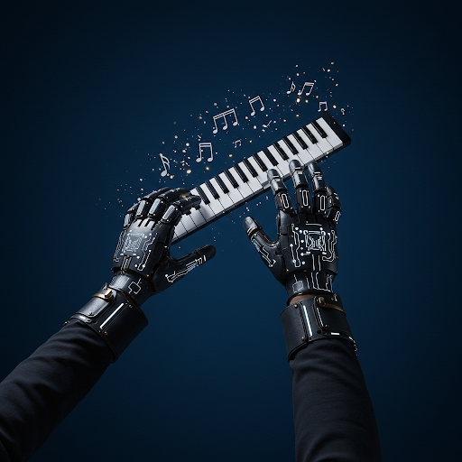

Image created using DALL·E by OpenAI


**Authors:**  
*Cole Schreiner*  
*Ryan Taylor*  
*Ana Elizabeth Villa*  

</div>

# Table of Contents

1. **[Introduction and Project Overview](#introduction)**

2. **[Background](#background)**

3. **Implementation**  
   **3.1 Piano Key Sensor**  
   &nbsp;&nbsp;&nbsp;&nbsp;3.1.1 [Fabrication of Sensor](#part-311-fabrication-of-sensor)  
   &nbsp;&nbsp;&nbsp;&nbsp;3.1.2 [Physical Design](#part-312-physical-design)  
   &nbsp;&nbsp;&nbsp;&nbsp;3.1.3 [Freeplay vs. Teaching](#part-313-software-development---freeplay-vs-teaching)  
   **3.2 Octave Sensor**  
   &nbsp;&nbsp;&nbsp;&nbsp;3.2.1 [BNO055 IMU](#part-321-bno055-imu)  
   **3.3 Sound System**  
   &nbsp;&nbsp;&nbsp;&nbsp;3.3.1 [I2S](#part-331-i2s)  
   &nbsp;&nbsp;&nbsp;&nbsp;3.3.2 [I2S to DAC breakout board - PCM5102A](#part-332-i2s-to-dac-breakout-board---pcm5102a)  
   &nbsp;&nbsp;&nbsp;&nbsp;3.3.3 [Chord Generation](#part-333-chord-generation)  
   &nbsp;&nbsp;&nbsp;&nbsp;3.3.4 [Clocking Issues and PLL’s Configuration](#part-334-clocking-issues-and-plls-configuration)  
   **3.4 Multiple I2C Lines**  
   &nbsp;&nbsp;&nbsp;&nbsp;3.4.1 [BNO055 Address](#part-341-bno055-address)  
   &nbsp;&nbsp;&nbsp;&nbsp;3.4.2 [OLED Screen Communication](#part-342-oled-screen-communication)  
   &nbsp;&nbsp;&nbsp;&nbsp;3.4.3 [I2C Bus Solder Board](#part-343-i2c-bus-solder-board)  
   **3.5 Enclosure and Power Board**  
   &nbsp;&nbsp;&nbsp;&nbsp;3.5.1 [Enclosure Unit](#part-351-enclosure-unit)  
   &nbsp;&nbsp;&nbsp;&nbsp;3.5.2 [Power Board](#part-352-power-board)  

4. **Evaluation**  
   4.1 [Piano Key Sensor Testing](#part-41-piano-key-sensor-testing)  
   4.2 [Octave Sensor Testing](#part-42-octave-sensor-testing)  
   4.3 [Sound System Testing](#part-43-sound-system-testing)  

5. **[Discussion and Conclusion](#discussion-and-conclusion)**

***Git Commit ID: ******293d18e19765ba1f13535088d457ceaf4fecfb49***

# 

# Introduction

Professor Piano is an interactive piano training glove designed to teach users how to play the piano through visual and motion-based guidance as well as a freestyle mode where users can explore octaves and chords on their own. The glove features LED indicators on the fingers that flash to signal which notes to play, as well as additional LEDs to indicate when to shift up or down an octave. Below is the State machine diagram:

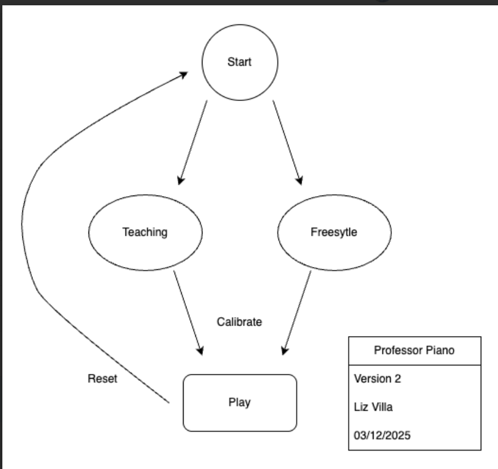

Figure 1: System Block Diagram

The system utilizes piezoelectric sensors and BNO055 IMU  to detect key presses, ensuring accurate note recognition. Additionally, the accelerometer and gyroscope in the BNO055 IMU are employed to track hand movements for octave transitions. By integrating these sensors, Professor Piano provides an intuitive and immersive learning experience, helping users develop muscle memory and improve their piano-playing skills efficiently.

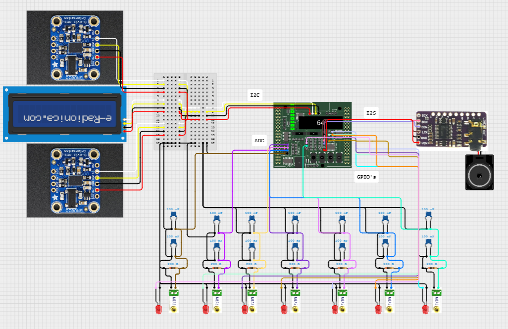

Fig. 2 Wiring diagram

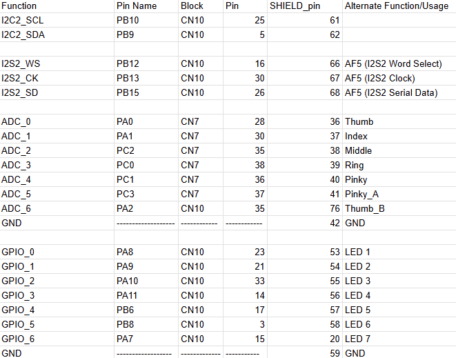

Fig: 3 Pin out map

Parts Required:

1 x STM32 microcontroller

14 x 0.01µF capacitors	(only 7 were used as we only hand time for 1 hand)

14 x 1MΩ resistors		(only 7 were used as we only hand time for 1 hand)

14 x piezoelectrics 		(only 7 were used as we only hand time for 1 hand)

14 x LEDs			(only 7 were used as we only hand time for 1 hand)

2 x BNO055			(only 1 was used as we only hand time for 1 hand)

1 x DFRobot 1602 RGBLCD gravity OLED Display

1 x PCM51012A

1 x aux cord and speaker

Or

1/2 x speakers with +/- pins

# Background

Learning to play the piano requires extensive practice, coordination, and muscle memory development. Traditional methods often rely on sheet music, visual demonstrations, or digital applications, but these approaches can be overwhelming for beginners who struggle with hand positioning and note recognition. Interactive learning tools, such as MIDI-based trainers and augmented reality applications, attempt to bridge this gap by providing real-time feedback and guided learning experiences. However, most of these tools still require a physical keyboard, limiting accessibility and portability.

The *Professor Piano* project aims to redefine piano learning by introducing a wearable glove-based system that provides motion-guided and visual feedback. The glove incorporates multiple sensors, including gyroscopes, accelerometers, and piezoelectric sensors, to detect finger movements, key presses, and octave shifts. LED indicators on each finger signal which notes to play, while additional LEDs guide octave transitions. This hands-free approach enables users to practice anywhere without the need for a physical piano, making learning more accessible and engaging.  

# Implementation

## Part 3.1: Piano Key Sensor

The piano key sensor is a critical component of the Professor Piano system, as it enables the detection of finger movements and key presses. This section outlines the design, fabrication, and testing of the sensor, which leverages piezoelectric technology to distinguish between different types of taps and translate them into corresponding piano key inputs.

### Part 3.1.1: Fabrication of Sensor

To create the piano key sensor, a piezoelectric sensor was selected due to its ability to generate voltage in response to mechanical stress, such as finger taps. The sensor was calibrated to detect variations in tap strength, which were then mapped to specific piano keys. Hard taps were assigned to white keys, while soft taps were mapped to black keys (sharp notes). This distinction was achieved by analyzing the voltage output of the piezoelectric sensor using an oscilloscope, which revealed significant differences in signal amplitude between hard and light taps.

To ensure the reliability and longevity of the system, a snubbing circuit was incorporated to protect the STM32’s IO shield from large voltage spikes generated by the piezoelectric sensor. This circuit, inspired by the design demonstrated in Lab 1, effectively dampens transient voltage spikes, ensuring stable and accurate signal processing. The snubbing circuit consists of a resistor and several capacitors in parallel with the piezoelectric sensor, which work together to dissipate excess energy and prevent damage to the microcontroller. Changing resistors had little effect on the voltage spikes, however, by carefully changing the capacitance of the circuit, I was able to craft specific peaks from the output voltage of the piezoelectric sensor.

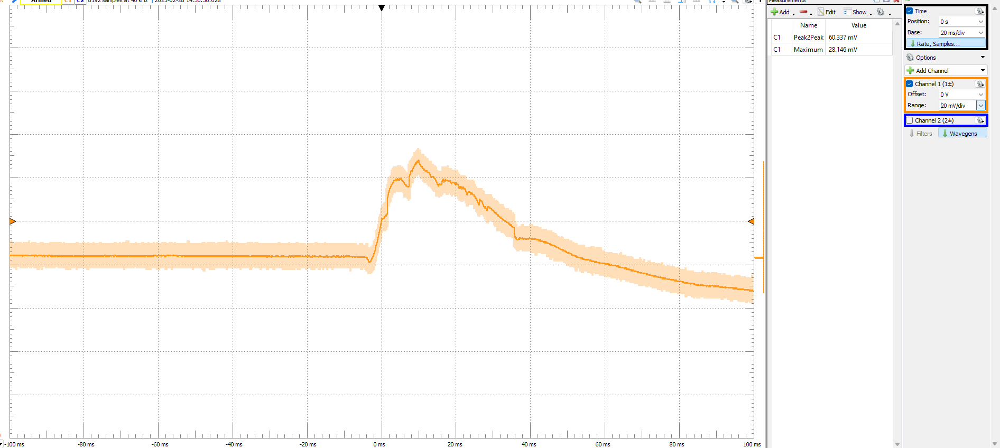

Image(1): Mid-air Soft Tap


Image(2): Mid-air Hard Tap

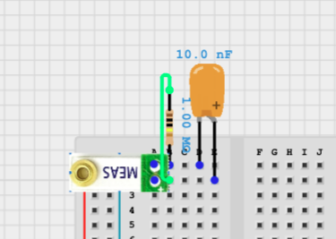

Image(3): Snubbed Piezo circuit

### Part 3.1.2 Physical Design

The physical design of the piano key sensor underwent several iterations to achieve optimal performance and reliability. The initial approach involved applying a moving average filter to analyze the differences in tap strength. However, this method muted the peaks necessary for accurate detection, making it unsuitable for distinguishing between hard and soft taps. After extensive testing and experimentation, I developed a peak detection algorithm, which proved to be the optimal solution. This algorithm was very effective at identifying the voltage peaks generated by the piezoelectric sensor, enabling precise differentiation between black and white keys.

To integrate the sensor into a wearable form factor, I fabricated a custom finger ring holder. This design allowed the piezoelectric sensor to be securely attached to each finger, creating a functional "piano key sensor." The ring holder was designed to be lightweight and unobtrusive, ensuring that it did not impede finger movement while maintaining consistent contact with the sensor.

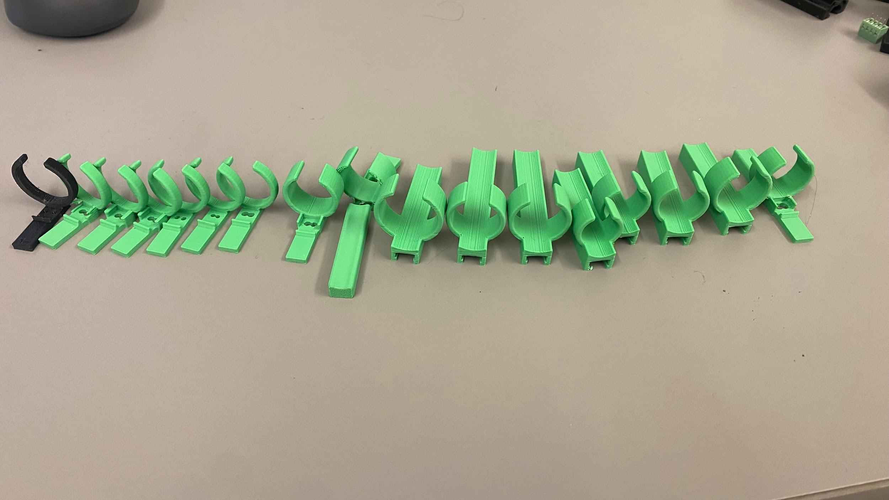

Image(4): Iterative design and testing

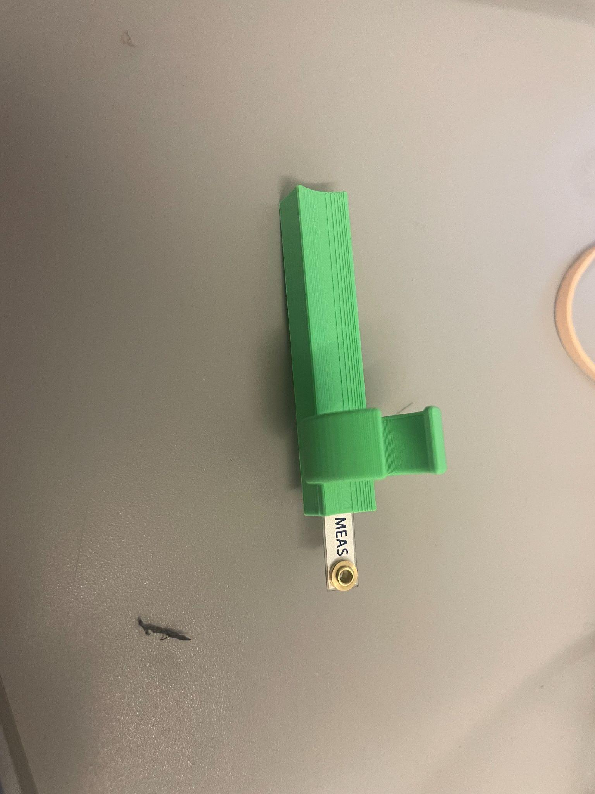

Image(5): Ring Piano Key

After successfully testing a single hand equipped with ring sensors on each finger, several issues arose that could not be resolved through software adjustments alone. These challenges included inconsistent tap detection, false triggers, and instability during use. The single greatest issue with this design was a problem in wetware. For the majority of humans, when we curl our pinky finger, the ring finger also curls at a similar rate. I attempted to create software functions to counteract this issue but ultimately decided a redesign to be the best solution.

To address these problems, a more robust and exoskeleton-like glove design was adopted. This new approach featured a rigid base palm plate, which provided structural support and improved the overall stability of the system. The palm plate minimized errors and false taps by ensuring that each finger movement was accurately detected and registered. The rigid base palm plate also enhanced the reliability of the piano key sensor by maintaining consistent alignment between the sensors and the user's fingers. This modification significantly improved the accuracy of tap detection, making the distinction between black and white keys more precise and reliable.

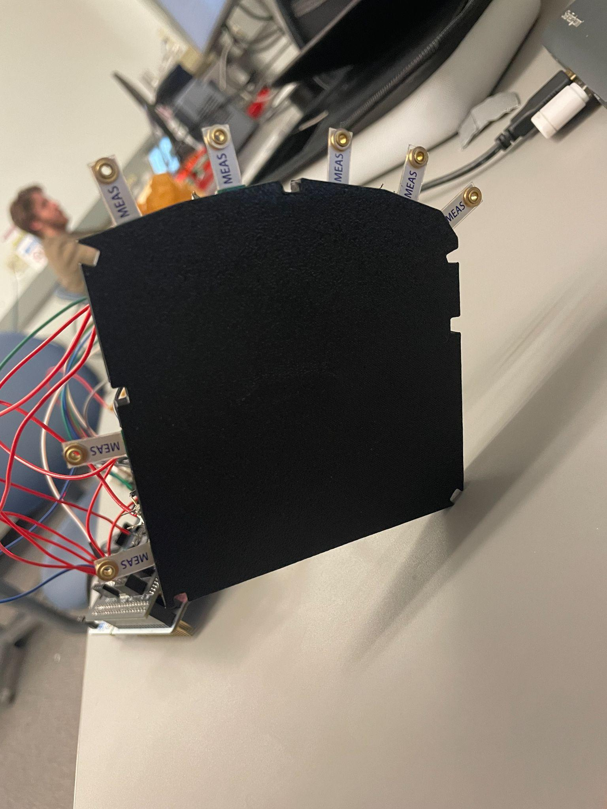

Image(6): Palm plate with Piano Keys

The transition from a ring-based design to an exoskeleton-like glove with a rigid palm plate marked a significant improvement in the system's performance. This design not only addressed the limitations of the initial prototype but also laid the foundation for a more user-friendly, accurate, and effective piano learning tool.

### Part 3.1.3: Software Development - Freeplay vs Teaching

Software development encompassed the majority of the work for this project, as it enabled the system to interpret sensor data and provide meaningful feedback to the user. I focused on creating robust algorithms and efficient data structures to handle real-time signal processing, note mapping, and user interaction. Below, I’ll discuss the key components of the software, including the peak detection algorithm, calibration mode, and the use of lookup tables for notes, fingers, and songs.

#### Peak Detection Algorithm

One of the most important functions I developed was the peak detection algorithm. This algorithm was responsible for identifying the voltage peaks generated by the piezoelectric sensor when a user tapped their finger. I implemented a moving peak detector that tracked the rising and falling edges of the signal to determine the exact moment a tap occurred. Furthermore, since the voltage spikes were gradual and not instantaneous, I needed to track if the next reading was higher than the last or if I had already read the peak of the recent tap. By comparing the current sensor reading to the previous one, the algorithm could distinguish between noise and valid taps, ensuring accurate detection of both hard and soft taps. This was crucial for differentiating between white and black keys.

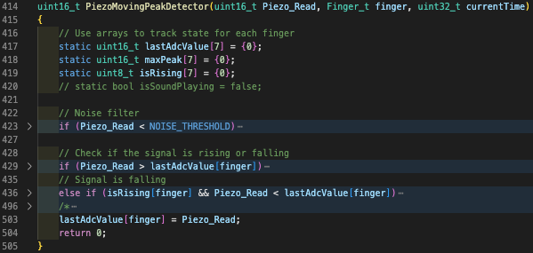

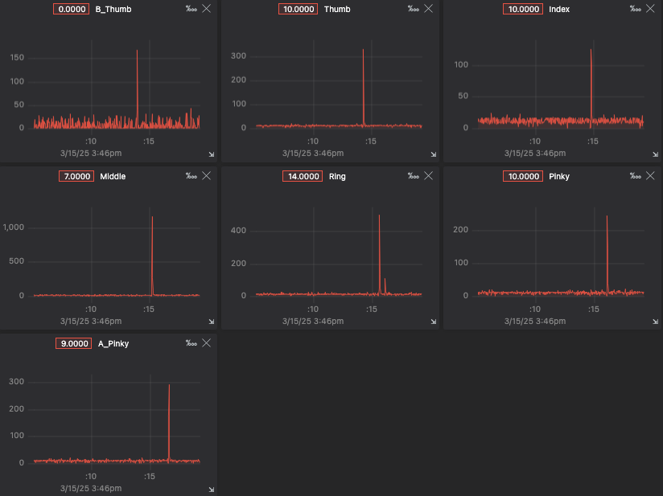

Image(7): Peak voltage output of Piezoelectric sensors for each finger

#### Calibration Mode

To ensure the system could adapt to different users and playing styles, I implemented a calibration mode. During calibration, the user was prompted to perform a series of soft and hard taps for each finger. The system recorded the peak values for these taps and calculated average thresholds for black and white keys. These thresholds were stored and used during normal operation to determine whether a tap corresponded to a white key (hard tap) or a black key (soft tap). Calibration mode was essential for personalizing the system and improving its accuracy across different users.

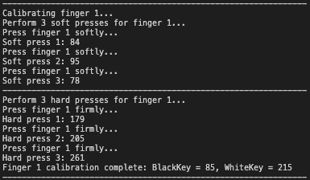

Image(8): Calibration Step for First Finger

#### Lookup Tables for Notes, Fingers, and Songs

To streamline note mapping and finger tracking, I used lookup tables extensively. For example, I created a lookup table that mapped each finger to its corresponding piano notes (e.g., thumb = C, index = D, etc.). Another table stored the frequencies of all notes across multiple octaves, allowing the system to generate the correct sound for each detected tap. Additionally, I implemented song lookup tables, which stored the sequence of notes for specific songs like "Twinkle Twinkle Little Star" and “Happy Birthday”. These tables made it easy to guide users through songs during the teaching mode and ensured the system could quickly retrieve the necessary data for real-time feedback.

`const`` ``Note_t`` ``NOTE_MAP``[``7``][``2``] =`

```
   {
       /* WHITE_KEY  BLACK_KEY      FINGER */
`       {``Note_B``, ``Note_B``},``  /* B_Thumb */`

`       {``Note_C``, ``Note_Cs``},`` /* Thumb */`

`       {``Note_D``, ``Note_Ds``},`` /* Index */`

`       {``Note_E``, ``Note_E``},``  /* Middle */`

`       {``Note_F``, ``Note_Fs``},`` /* Ring */`

`       {``Note_G``, ``Note_Gs``},`` /* Pinky */`

`       {``Note_A``, ``Note_As``}``  /* A_Pinky */`

};

`const`` ``char`` *``TWINKLETWINKLE``[]`` =`

   {...


`const`` ``char`` *``GetNoteString``(``Note_t`` ``note``)`

{
`   ``switch`` (``note``)`

   {
`   ``case`` ``Note_B``:`

`       ``return`` ``"B"``;`

`   ``case`` ``Note_C``:`

`       ``return`` ``"C"``;`

`   ``case`` ``Note_Cs``:`

`       ``return`` ``"C#"``;`

...
   }
};
```
#### Integration

With the core software components in place, the system was capable of operating in two distinct modes: freeplay and song teaching. In freeplay mode, users could play any note they wanted, with the system providing real-time feedback through sound and LEDs. In teaching mode, the system guided users through specific songs, helping them learn the correct sequence of notes. The next section will explore these two modes in detail, highlighting their unique features and how they enhance the user experience.

### Part 3.1.4: Freeplay vs. Teaching

With the fabrication of the piano key sensor complete, I implemented two distinct modes to enhance the user experience: Freeplay Mode and Teaching Mode. These modes were designed to cater to different learning styles and skill levels, providing users with flexibility and guided instruction.

#### Freeplay Mode

Implementing Freeplay Mode was relatively straightforward once the piezoelectric sensors could reliably distinguish between black and white keys based on tap intensity. In this mode, users could play any note or chord they wanted, allowing for creative exploration and improvisation. The system mapped each detected tap to its corresponding note, providing real-time feedback through sound and visual cues.

- LED Feedback: The LEDs lit up according to the note being played or just played, giving users immediate visual confirmation of their actions.

- LCD Display: The LCD screen displayed the name of the note that was played, helping users learn and recognize the notes as they played.

Freeplay Mode was ideal for users who wanted to experiment with the piano without the constraints of a structured lesson. It also allowed users to play chords by tapping multiple fingers simultaneously, making it a versatile and engaging feature.

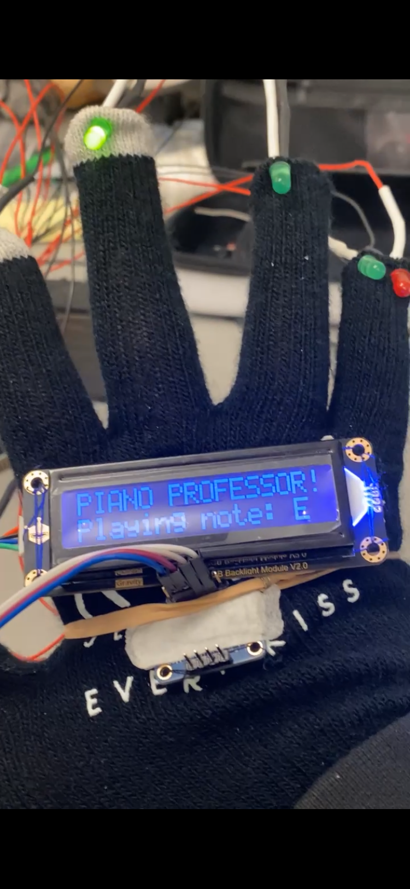

Image(9): LCD Display in Freeplay with Previous Note’s LED

#### Teaching Mode

The Teaching Mode, on the other hand, was more complex to implement. This mode was designed to guide users through specific songs, starting with "Twinkle Twinkle Little Star." The goal was to provide a structured learning experience that helped users build muscle memory and improve their timing and accuracy.

- LED Guidance: In Teaching Mode, the LEDs served as visual cues, lighting up to indicate which finger and note to play next. Users had to play the correct note to advance to the next step in the song. If a wrong note was played, the system would still produce the sound for that note, but the LED would not change, prompting the user to try again.

- LCD Instructions: The LCD screen displayed the name of the note the user needed to play, providing clear instructions throughout the learning process. At the end of the song, the screen would display: "Congratulations! You played the entire song!"

#### Challenges and Solutions

One of the biggest challenges in implementing Teaching Mode was ensuring that the system could accurately track the user’s progress through the song. I used a state machine to manage the sequence of notes, advancing only when the correct note was played. This required precise synchronization between the piezoelectric sensors, LEDs, and LCD screen. Additionally, I had to account for polyphonic input (multiple notes played simultaneously) to ensure the system could handle chords without errors. We will go into more detail about the audio protocol in *Section 3.3.*

The combination of Freeplay and Teaching Modes made the system versatile and accessible to users of all skill levels. Freeplay Mode allowed for creative exploration, while Teaching Mode provided structured guidance for learning specific songs. Together, these modes created a comprehensive piano learning experience that was both engaging and educational.


## Part 3.2: Octave Sensor

### Part 3.2.1: BNO055 IMU

The goal is to create three distinct octave ranges that provide a natural piano-playing experience. One of the main challenges is ensuring that the accelerometer remains robust against noise and minor hand movements to maintain a smooth user experience. Since the system incorporates two IMU sensors.

When testing the sensors for octave switching, I initially tried using the gyroscope and accelerometer separately. However, the gyroscope alone resulted in false octave changes every other attempt and required exaggerated angular motion for somewhat reliable detection. The accelerometer, on the other hand, struggled to accurately detect octave changes and also needed extreme movements to register a switch. By combining both sensors along the x-axis, I was able to balance their weaknesses, leading to a smoother and more natural octave transition. This integration reduced false octave shifts and improved the overall responsiveness of the system. Below I have attached a snippet of my “Octave.c” file to show how I changed octaves:

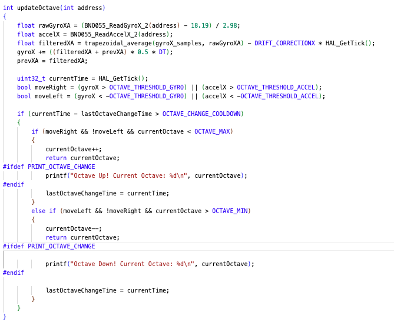

## Part 3.3: Sound System

### Part 3.3.1: I2S

For this project, I employed the I2S (Inter-IC Sound) communication protocol for audio playback. I2S was chosen because it is specifically designed for transmitting sound data between integrated circuits. Traditionally, a microcontroller can produce audio signals by generating a Pulse Width Modulation (PWM) output at a single frequency, creating a simple tone. However, real musical instruments naturally combine multiple signals simultaneously. A more accurate way to replicate this behavior is to sum these signals in the digital domain and convert them to analog using a Digital-to-Analog Converter (DAC).

One drawback of using a DAC with high resolution (e.g., 16 bits) is that it typically requires a significant number of pins (16 lines for data). By contrast, sending audio data over an I2S interface maintains high resolution while requiring far fewer pins. Although I2S is similar to I2C, it includes an additional line dedicated to distinguishing right- and left-channel data, which allows stereo playback. This extra signal is essentially a 50% duty cycle clock that toggles to indicate the current channel. These characteristics make I2S especially suitable for microcontroller-based audio systems, and thus it was chosen for this project.

Beyond basic audio playback, the I2S protocol also enables advanced digital audio features such as real-time filtering using FIR or IIR filters and voice modulation, all of which contribute to higher-quality sound. It further supports stereo playback, offering the opportunity to experiment with channel separation and spatial audio effects. Additionally, because I2S can process .wav files stored on SD cards or other flash memory, integrating a .wav file parser would allow more intricate sound effects or music to be played, expanding the potential applications of this project.


### Part 3.3.2:  I2S to DAC breakout board - PCM5102A

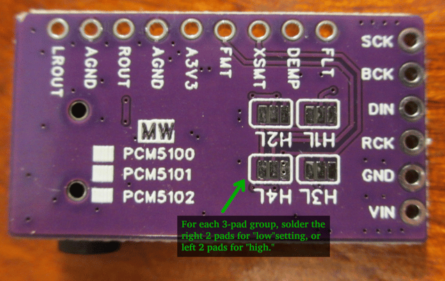

Source:[https://raspberrypi.stackexchange.com/questions/76188/how-to-make-pcm5102-dac-work-on-raspberry-pi-zerow](https://raspberrypi.stackexchange.com/questions/76188/how-to-make-pcm5102-dac-work-on-raspberry-pi-zerow)

Due to little datasheets accessible for this board online, this forum provided valuable information on how to correctly use this wonderful breakout board. Teaching me about the different configurations and perks that come with using the PCM5102.

This board has a lot of configurations and abilities.

Pin 1 - FLT - Filter select: Normal latency (Low) / Low latency (High)

Pin 2 - DEMP - De-emphasis control for 44.1kHz sampling rate: Off (Low) / On (High)

Pin 3 - XSMT - Soft mute control: Soft mute (Low) / soft un-mute (High)

Pin 4 - FMT - Audio format selection : I2S (Low) / Left justified (High)

Pin 5 - aVdd - Vdd(3.3V or 5V)

Pin 6 - Gnd

Pin 7 - R - Right Channel Output

Pin 8 - Gnd

Pin 8 - Left Channel Output

Vin - 3.3V - 5V

Gnd - Gnd

LCK - "word select" (WS). Typically called "left-right clock (LRCLK) or "frame sync" (FS)

DIN - “serial data” (SD)

BCK - "bit clock" (BCLK)

SCK - Master Clock

For our setup, we used a sampling rate of 48 kHz. As recommended in forum posts, we set FLT low. We also set DEMP low because our sampling rate was 48 kHz rather than 44.1 kHz. The XSMT pin was driven high, as it functions as an enable pin, and FMT was driven low in order to use the I2S protocol. These pins were configured via solder pads on the back of the board rather than with jumper wires, because the parasitic capacitance of long wires can introduce voltage spikes and disrupt timing.

During initial testing, I used jumper wires from Vcc and GND on a breadboard to set the enable pins. This resulted in severe noise in the output signal—although the intended signal could be faintly heard, it was heavily distorted by interference. Removing the breadboard entirely and soldering the pins directly on the board eliminated the noise, producing a clean sinusoidal wave.

We also had the option of providing a master SCK signal directly from the STM32 microcontroller at the appropriate frequency. However, by soldering the jumper to use the internal phase-locked loops (PLLs), no external SCK was required. Given our experience with potential noise from the breadboard setup, relying on the internal PLLs was more reliable than sending a 48 kHz clock signal over a wire.

Note: If you solder the #&L that will set the config pin high, and the #&H will set the pin low.

### Part 3.3.3: Chord Generation

Initially, I attempted chord generation by creating a Python script that produced a .wav file containing a sine wave at a specific frequency. This file was then converted into a C header and read by a “wav packet reader” function in the microcontroller firmware. Although this approach did generate a reasonable tone, it proved extremely demanding on memory. A 0.25-second waveform alone consumed more than 10% of the available RAM, and reducing it to 0.05 seconds introduced audible inconsistencies in the wave itself. Moreover, storing waveforms for an entire range of musical notes—particularly when considering multiple octaves and chords—would quickly exceed flash capacity. This left the choice of either drastically limiting playable frequencies or devising a new technique for real-time tone generation.

The solution to this issue was on-the-fly chord generation allows audio signals to be created dynamically rather than relying on storing entire .wav files. The key component of this process is a “sine wave table,” which is an array that represents exactly one full cycle of a sine wave. In typical implementations, the array might hold 1024 samples, each scaled to the 16-bit audio range. By reading this table at different speeds, a wide variety of frequencies can be produced from a single data set. This approach greatly reduces memory usage and facilitates real-time audio generation.

The audio data produced by summing active voices is written to an audio buffer that is divided into two halves. The hardware peripheral configured for I2S communication, coupled with DMA, automatically transmits samples from one half while the software refills the other half. An interrupt signals when the half-buffer is ready to be refilled, and another interrupt fires once the entire buffer has been transmitted. The code thus alternates between these two buffer segments in a continuous loop, ensuring uninterrupted sound output. Because the table-based generation logic runs each time an interrupt indicates that samples must be refreshed, the system never needs to store entire waveforms for each note. Instead, it only needs to store a single sine wave cycle and a small set of parameters controlling voice activity.

By handling audio generation in this manner, the design remains flexible, efficient, and relatively simple. Unlike a static approach in which large .wav files must be stored for every note and chord, the on-the-fly system uses minimal memory and accommodates variations in pitch and chord structure merely by adjusting phase increments. This makes it possible to play up to four simultaneous notes, which covers most chord requirements in typical musical contexts. The double-buffer interrupt mechanism guarantees a reliable flow of audio, while amplitude scaling and clipping help avoid distortion when multiple voices are summed. Overall, this method provided a clean and effective way to generate chords and other musical content without exceeding the memory limits of a microcontroller.

### Part 3.3.4: Clocking Issues and PLL’s configuration

One of the first significant challenges encountered was ensuring that the STM32 board had a properly configured system clock. The microcontroller includes an internal 8 MHz crystal, which can be fine-tuned through Phase-Locked Loops (PLLs) to generate a range of clock frequencies for different peripherals. Under normal circumstances, this process should be transparent: a single configuration file or project setting specifies the correct external clock frequency, and the HAL library (Hardware Abstraction Layer) automatically calculates the required PLL multipliers and dividers.

However, in this project, the initial assumption—that the system clock was set to 8 MHz—proved incorrect. Upon using HAL_RCC_GetSysClockFreq() (or another diagnostic function) to print the actual core clock speed, it turned out that the microcontroller was running at 25 MHz instead. Investigating the source of the 25 MHz setting required an exhaustive search through the codebase and the STM32 framework drivers. Although two separate files defined HSE_VALUE (the external crystal frequency) and were updated from 25 MHz to 8 MHz, the changes did not propagate to the compiled program. Eventually, a third configuration file was discovered in the drivers folder that still declared HSE_VALUE as 25 MHz, overriding the earlier definitions.

Once this setting was corrected, the system clock frequency was accurately configured. Subsequent features, including precise timing for I2S audio output and other peripherals, also benefited from the corrected clock configuration. This incident highlighted the importance of thoroughly verifying clock definitions across all relevant files and ensuring that no stale or conflicting definitions remain. As a note for future development, the project’s README.md now documents these steps to help prevent similar issues.

.platformio\packages\framework-stm32cubef4\Drivers\STM32F4xx_HAL_Driver\Inc\stm32f4xx_hal_conf.h

Line 95:

from this: #define HSE_VALUE 25000000U /*!< Value of the External oscillator in Hz */

to this: #define HSE_VALUE 8000000U /*!< Value of the External oscillator in Hz */

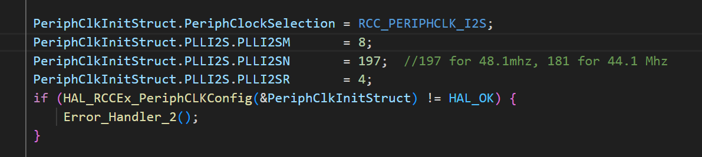

Using these values for the MNR PLL’s. I got to a frequency of 48.1 Mhz. This happens because you get Clk_freq =
8Mhz / 8 * 197 /4
 => 49.25 Mhz. While what I saw on the oscilloscope was 48.1Mhz. My hypothesis for this discrepancy could be due to parasitic capacitance in the wires causing the frequency to slow down. Though I need the PCM5102 board to see a 48 Mhz signal so this works for this application.

## Part 3.4: Multiple I2C lines

### Part 3.4.1: BNO055 Address

To implement two BNO055 sensors for the Professor Piano project, we can leverage the alternative address mode of the BNO055, which allows us to use two sensors on the same I2C bus without address conflicts. By default, the BNO055 sensors come with the same I2C address of 0x28, which would normally prevent us from addressing both sensors independently. The BNO055 file given to us has all the functions using the default 0x28 address, we just changed the functions to take in an uint8_t address, for example: 

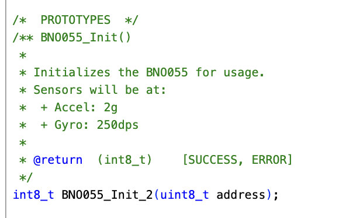

This then allows two BNO055 IMUs to be used by connecting the ADR pin to GND, the sensor will use its default address of 0x28, while connecting the ADR pin to VCC will change the address to 0x29. One other thing that was done was adding a function to ensure that there was a successful connection to the sensor and readout the chip ID (BNO055_ADDRESS_A or BNO055_ADDRESS_B).

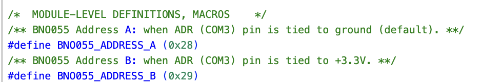

With this setup, we can have two BNO055 sensors, one at address 0x28 and the other at 0x29, communicating with the microcontroller over the same I2C bus. This will allow us to track hand movements on both the left and right hands independently, a key requirement for the Professor Piano project, which uses these sensors to detect and manage octave changes during gameplay. By assigning the left-hand sensor to one address and the right-hand sensor to another, the system can seamlessly differentiate between the two hands, enabling accurate control of the octaves while playing.

This configuration simplifies the integration of two BNO055 sensors into the project without needing additional hardware, such as I2C multiplexers. By using the two different I2C addresses, we ensure that both sensors can be addressed independently, allowing for precise tracking of both hands during interaction with the piano keys.

### Part 3.4.2: OLED Screen Communication

For the visual interface, I repurposed an OLED screen from a previous course project (CSE 121 - Embedded System Design). The display, a DFRobot Gravity OLED module, communicates over the I2C protocol and provides a simple way to add text and status updates directly on the device. By leveraging I2C for both the OLED and other peripherals, I was able to maintain a straightforward system architecture with minimal pin usage.

The initial code base for the DFRobot OLED was taken from the GitHub repository at [https://github.com/DFRobot/DFRobot_RGBLCD](https://github.com/DFRobot/DFRobot_RGBLCD). Although this code was written in C++, I translated it into C to ensure compatibility with my existing firmware and to integrate with the STM32 I2C driver functions. This process involved rewriting object-oriented constructs into equivalent procedural C functions and updating all I2C read/write operations to match the HAL library calls. Despite being somewhat labor-intensive, the reference code proved invaluable: it revealed the correct register addresses for controlling the OLED’s display and RGB features and provided color mapping definitions that were directly applicable to my hardware setup.

Once the translation was complete, the microcontroller could successfully communicate with the OLED via I2C. Text that had previously been sent to a serial terminal for debugging or user interaction was redirected to the OLED, adding an interactive interface for real-time feedback.


### Part 3.4.3: I2C Bus Solder Board

During development of the I2S board, I observed a marked improvement in the smoothness of the output waveform after removing as many breadboard components and external wires as possible. Previously, the signal had only somewhat resembled the intended sine wave, but once these sources of parasitic capacitance were eliminated, the output closely matched the desired waveform. Based on this experience, I decided to avoid breadboards entirely and instead created a custom I2C Bus Solder Board. This board consolidated the three I2C-connected components and provided stable power (Vcc) and ground (GND) connections for the I2S module. Beyond enhancing signal integrity, this soldered assembly presented a more professional appearance and streamlined the overall integration of the device.


Figure: This shows the Board. The 3 inputs all share the same relative input ports, as the top pin is the SCL, next pin down is the SDA, next pin down is Gnd, and finally the bottom pin is Vcc. This helps the simplicity of connecting the I2C together and removing the possibility of reverse connections possibly destroying the I2C device.


## 3.5 Enclosure and Power Board

### Part 3.5.1: Enclosure Unit

The enclosure unit is relatively straightforward, designed primarily to contain and organize the inevitable tangle of wires emerging from the STM32. It consists of a simple box with dedicated mounting points for the STM32, the I2C bus protoboard, the power board, and the I2S PCM5102 board. Additionally, a power switch located on the top allows the entire system to be turned on or off with ease.

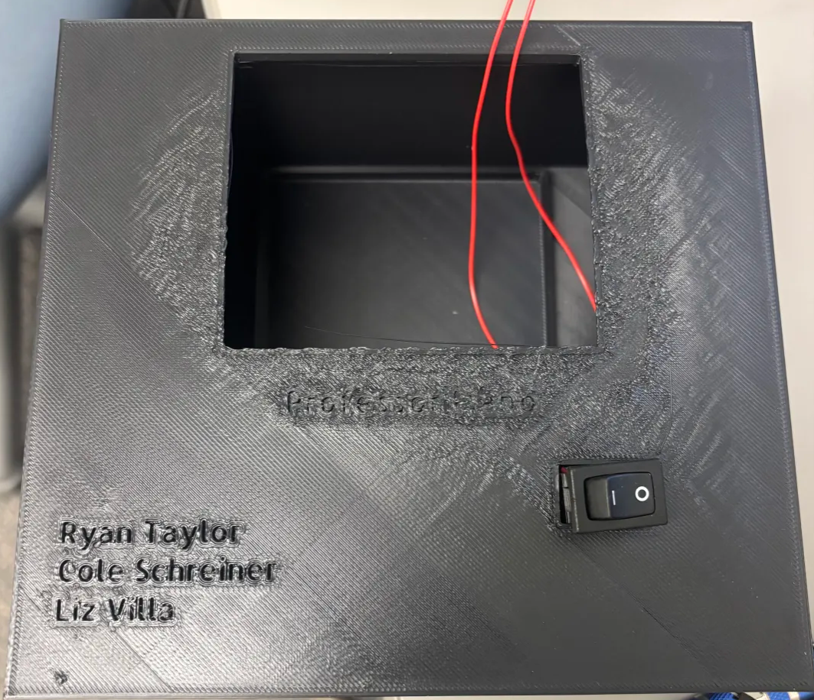

### Part 3.5.2: Power Board

The power board was inspired by the goal of making the device feel more autonomous, allowing it to run entirely on a 9V battery without requiring a separate monitor or power supply. Despite its simplicity, the board incorporates a 3.3V linear regulator, a reverse-protection diode, a status LED, and a power switch to facilitate reliable and convenient operation.


# 

# Evaluation

## Part 4.1: Piano Key Sensor Testing:

Since we chose to use a fabric glove, we were able to achieve many consistent results for hard taps on the piezoelectric sensor. However, it was difficult to reliably press the piezos soft using the custom threshold values I originally measured early on in the project. To combat this, I created a calibration mode which would customize hard and soft taps to each user’s ability.

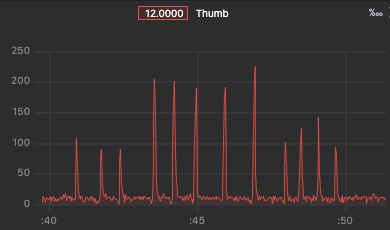

Image(1): Distinction between Soft Taps (Black Keys) and Hard Taps (White Keys) Raw Values

To evaluate the percentage of reliably accurate taps using the piezo calibration, I attempted to play a specific note 10 times. I did this for each finger, sharp notes and base notes (white and black keys).

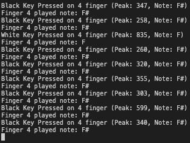

Image(2): Example of attempting to press F# 10 times

If you notice from the image above, There are 9 presses, yet my attempt for this finger received a 80% in the chart below. This is because I missed the 3rd tap so when attempting to press harder, I overshot the black key and triggered a white key threshold. This may be a common occurrence for new users when getting used the the Professor Piano system. It would be very easy to achieve a score of 100% for every finger, but I wanted this data to reflect a new user’s experience when calibrating and playing for the first time or so.

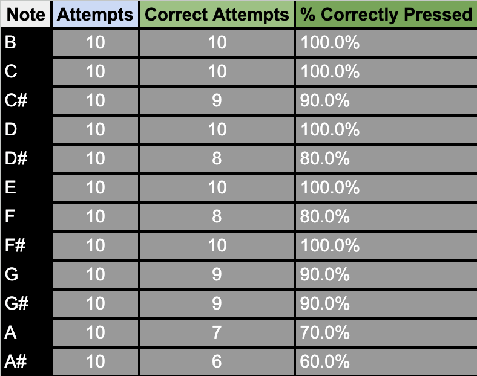

Furthermore, you will notice that notes B and E both have a 100% attempt rate. This is because there is no B# or E# so it is extremely unlikely for the user to accidentally press too soft to trigger the threshold for that note. Similarly, most base notes (not sharp notes ‘#’) will achieve a 100% attempt rate because it is much easier to press a note firmly than to control your finger and press softly. As for G, G#, A, and A# I have much less dexterity in my pinky and ringer finger and therefore those fingers were less reliable when attempting to play their respective piano keys. I tried many things to combat this including manually setting threshold values, adjusting the angle of the piezo to the finger, and adding materials between the piezo and the glove to achieve a more harsh impact. These all made improvements on the data, but again, I want this to reflect a new user’s experience when trying on the glove for the first time.

There is a noise threshold that will not register readings below a specific value. Therefore, it is almost impossible to miss a white key (unless pressing too softly) but it is much easier to attempt a black key and either press below the noise threshold or above the white key threshold.

`int`` ``WhiteOrBlackKey``(``int`` ``PiezoPeak``, ``Finger_t`` ``finger``)`

```
{
	Switch/Case logic...
...
...

`   ``// Check if the peak corresponds to a white or black key`

`   ``if`` (``PiezoPeak`` > ``whiteKeyThreshold``)`

   {
`       ``validPeakDetected`` = ``1``;`

`       ``return`` ``WHITE_KEY``;`

   }
`   ``else`` ``if`` ((``PiezoPeak`` > ``blackKeyThreshold``) && (``PiezoPeak`` < ``whiteKeyThreshold``))`

   {
`       ``validPeakDetected`` = ``1``;`

`       ``return`` ``BLACK_KEY``;`

   }
`   ``else`

   {
`       ``// Piezo reading is too small or invalid`

`       ``validPeakDetected`` = ``0``;`

`       ``return`` ``INVALID_KEY``;`

   }
}
```
The Professor Piano system demonstrated a high level of accuracy in distinguishing between hard and soft taps, thanks to the implementation of the calibration mode and the robust peak detection algorithm. However, the system does require some getting used to, particularly for new users who may struggle with the precision needed to consistently trigger soft taps without overshooting into white key thresholds. This learning curve is a natural part of adapting to any new interface, and with practice, users can achieve reliable results.

Despite the challenges posed by material constraints and the limited timeframe of just 10 days, I am extremely proud of the progress I made. The system successfully integrates hardware, software, and my team members’ functions and protocols, to create a functional and innovative piano learning tool. With further refinement, such as improved ergonomics and enhanced sensor placement, Professor Piano has the potential to become a marketable product that could make piano learning more accessible and enjoyable for people of all skill levels. This project not only met but exceeded my expectations, and I am excited about the possibilities for its future development.

## Part 4.2: Octave Sensor Testing:

The data below shows that the system is pretty accurate in detecting octave changes, with a total error (Expected vs Actual) of just 3.17%. This means that the actual results are very close to what we expected, so the octave changes are mostly happening as intended. However, the total error (Expected vs Reattempts) is much higher at 10.32%, which means the system requires less attempts to get the octave change right. This could be due to occasional misreads, leading to the need for reattempts to correctly detect the shift or not moving the IMU with enough force.

In terms of how well the octave-changing works, the system does a good job, but there's room for improvement. Right now, if you want to switch from octave 3 to octave 1, the system makes you step through octave 2 first, which isn’t very efficient. It would be much better if the system could directly switch from octave 3 to octave 1 without having to go through the middle one. This would make the system faster and easier to use. One way to fix this would be to tweak the system's sensors or settings to better detect the hand movement and recognize when to jump directly between octaves.

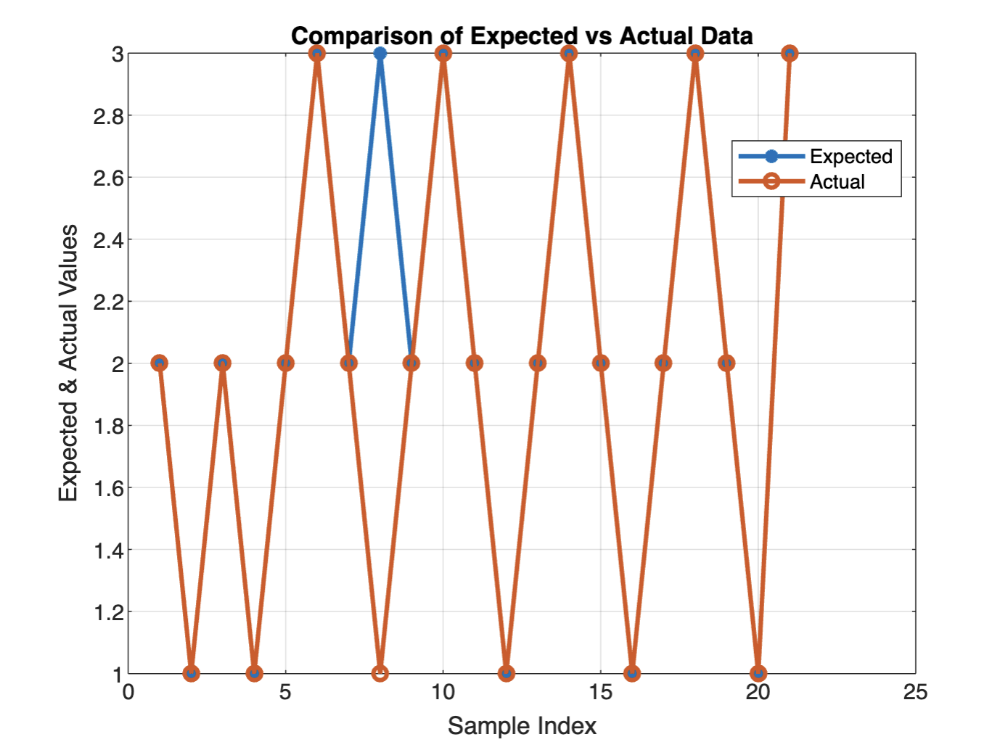

Table 1: Octave Change Reliability		   Graph 1: Expected vs. Actual Octave Data


## Part 4.3: Sound System Testing:

I have configured the I2S code to output a LCK clock of 48 Mhz. This results in a BCK using the equation = LCK*2*16 bit data rate. This would result in a 1.53Mhz BCK. I have verified these values using the oscilloscope:

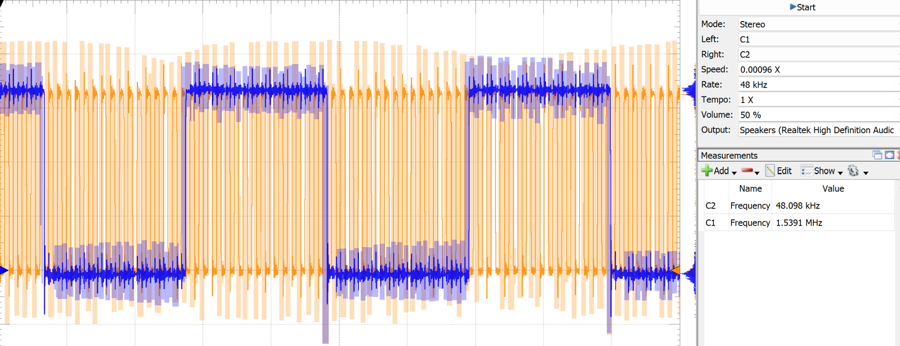

Channel 1 is yellow showing a 48 Mhz LCK

Channel 2 is blue showing a 1.53Mhz BCK

I used the FFT function on the Waveforms application using the AD2 in order to determine I was playing the correct frequency.

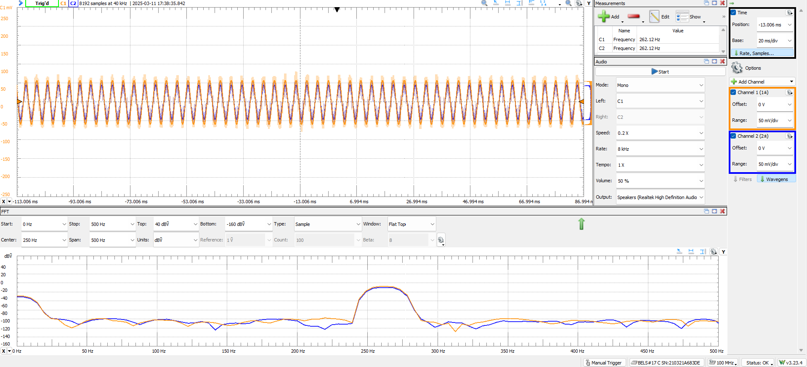

Playing 1 frequency at 261.6. It shows 262.1. Close enough.

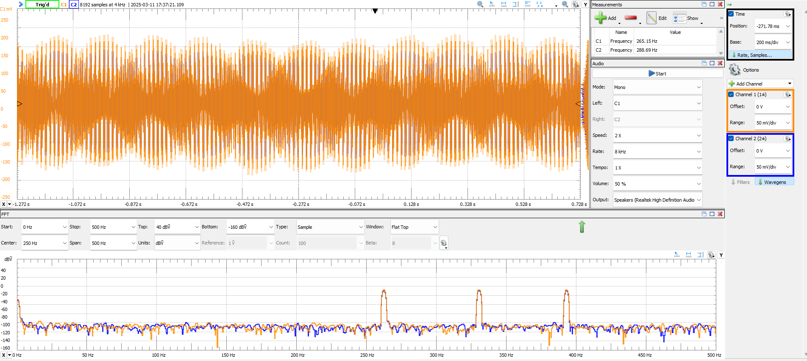

Playing 3 frequencies at 261.6, 329.6, 392

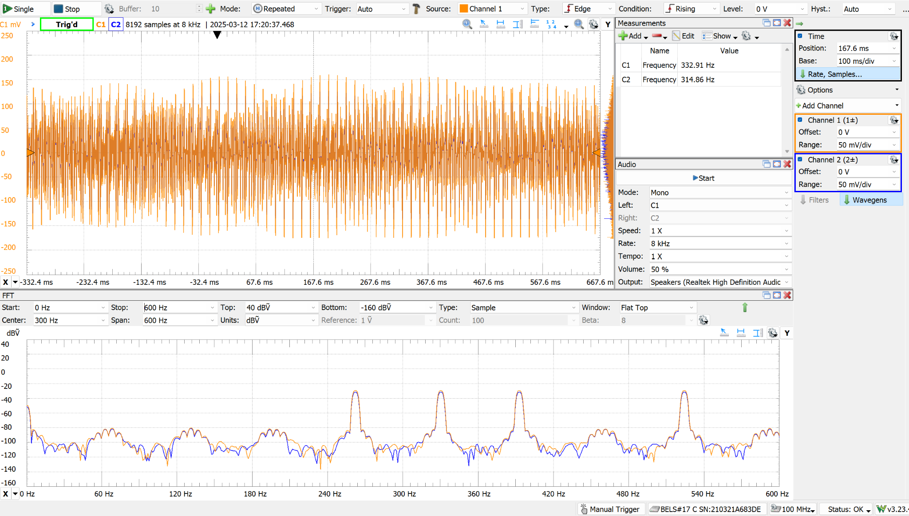

Playing 4 frequencies at 261.6, 329.6, 392.0, 523.3

## Part 4.4: I2C Bus Line Testing

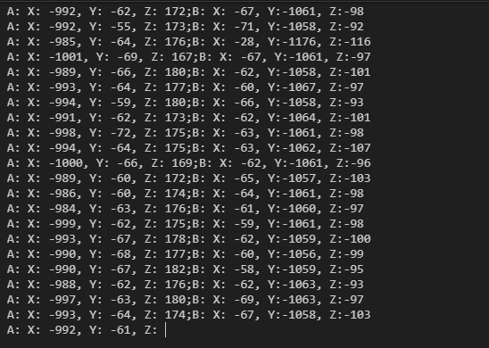

Proof of concept reading both hands BNO055’s at the same time by calling the address of the BNO055 connected though the I2C connector board.


Figure: This image shows the I2C bus line in action. I have the 2 BNO055’s attached at different addresses, defined by the orange wire. These are being read by the microcontroller and outputting the BNO055 raw X values for both BNO_A and BNO_B onto the DFRobot LED Display screen, proving that all 3 I2C devices are being read and written to at the same time.

# Discussion and Conclusion

In our journey to develop Professor Piano, we successfully integrated a variety of hardware, including piezoelectric sensors for finger taps, a BNO055 9-axis IMU for octave changes, and an I2S-based audio system. Combined with a custom glove and exoskeleton design, these components demonstrated that a portable, self-contained piano learning device is both feasible and effective.

One of our primary challenges involved the piezoelectric sensors, which required balancing hardware refinements and software calibration. Distinguishing between soft (black key) and hard (white key) taps proved inconsistent at first due to variations in user finger force and glove fit. Implementing a snubbing circuit, refining sensor placement, and adding a per-user calibration mode significantly improved tap detection, though some inaccuracies can still emerge when users first begin practicing.

A similar challenge arose with the BNO055 IMU, which needed data from both its accelerometer and gyroscope to reliably detect octave transitions. Although early prototypes struggled with false triggers and required exaggerated wrist movements, careful sensor fusion reduced these issues. While the glove still only supports stepwise octave switching, further algorithmic refinements could enable more direct jumps between non-adjacent octaves.

Despite these hurdles, the on-the-fly chord-generation subsystem performed well. By storing a single sine-wave cycle and using interrupt-driven DMA transfers, we avoided large .wav-file storage while supporting multiple simultaneous notes in real time. This approach provided a flexible platform for both freeplay and song-teaching modes and demonstrated the capacity for robust, low-memory audio processing.

Given our time constraints, we settled on finalizing a single-glove prototype rather than the two-glove system originally envisioned. Even so, this single-glove version demonstrated accurate note detection, smooth octave transitions, and real-time chord generation, serving as a proof of concept that underscores the potential for a more expansive system in future iterations. With additional development time, we would refine the glove’s ergonomics, allow direct multi-octave leaps, enhance the teaching features, and ultimately integrate a second glove to support a full two-handed experience.

Overall, Professor Piano demonstrates how tactile and motion sensors, combined with real-time signal processing and an interactive user interface, can be leveraged in a wearable form factor to facilitate piano learning. By uniting hardware and software knowledge in a cohesive system, we have laid a foundation for a low-cost, accessible musical tool that encourages users to explore and practice anywhere, anytime.

References:

[https://github.com/DFRobot/DFRobot_RGBLCD](https://github.com/DFRobot/DFRobot_RGBLCD)

[https://raspberrypi.stackexchange.com/questions/76188/how-to-make-pcm5102-dac-work-on-raspberry-pi-zerow](https://raspberrypi.stackexchange.com/questions/76188/how-to-make-pcm5102-dac-work-on-raspberry-pi-zerow)


Photos:


